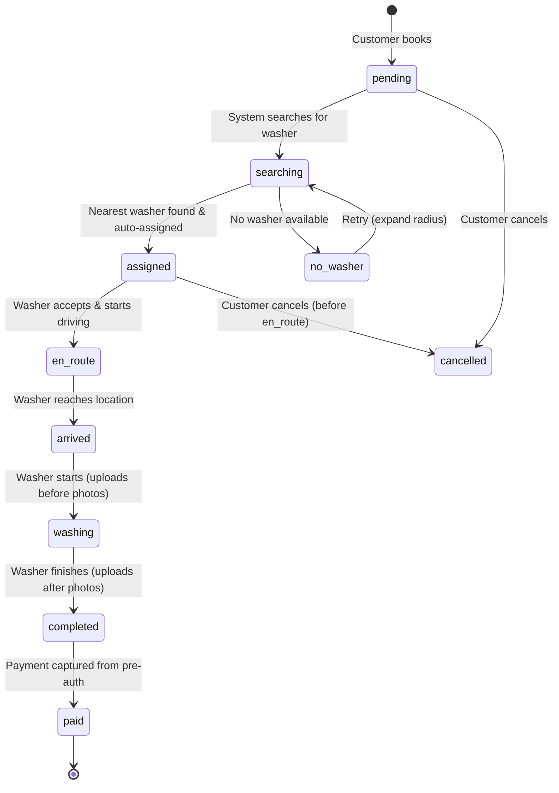
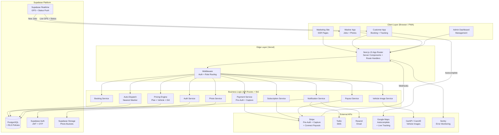
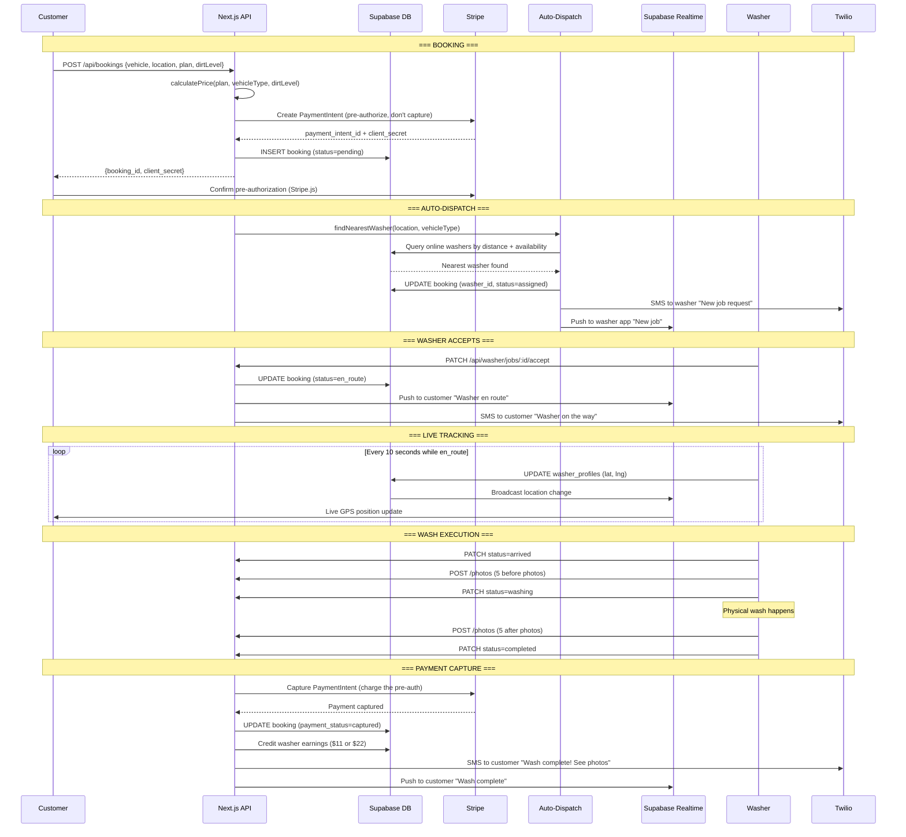
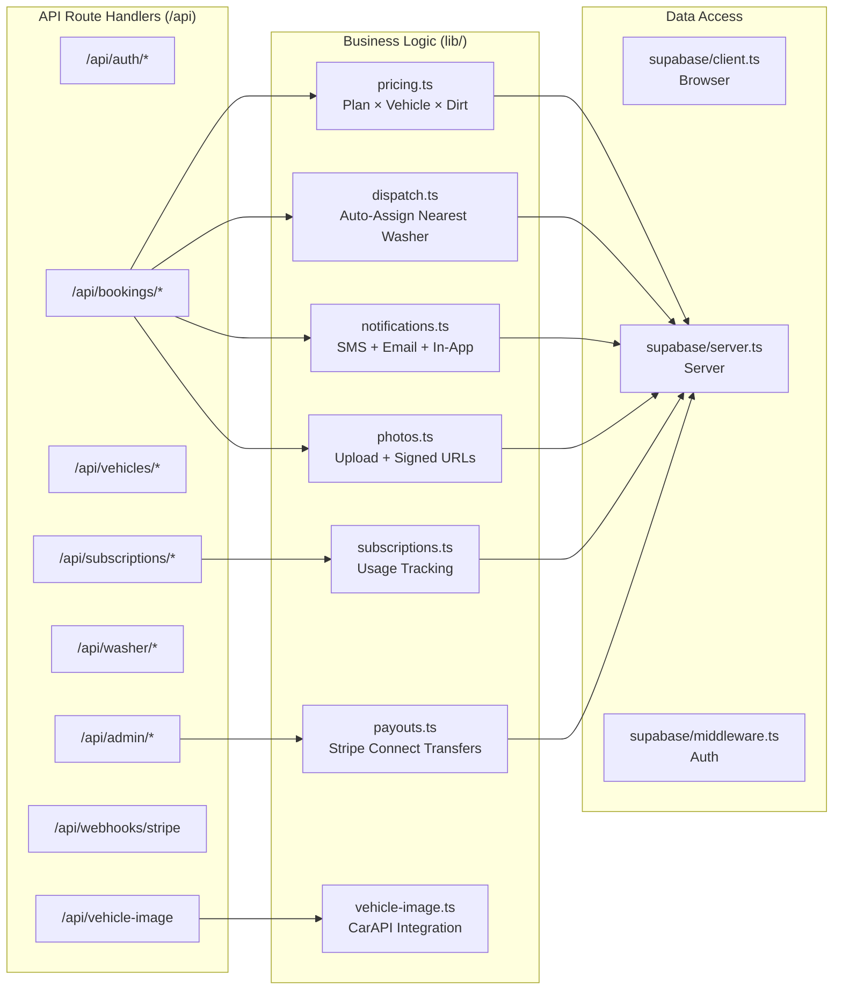
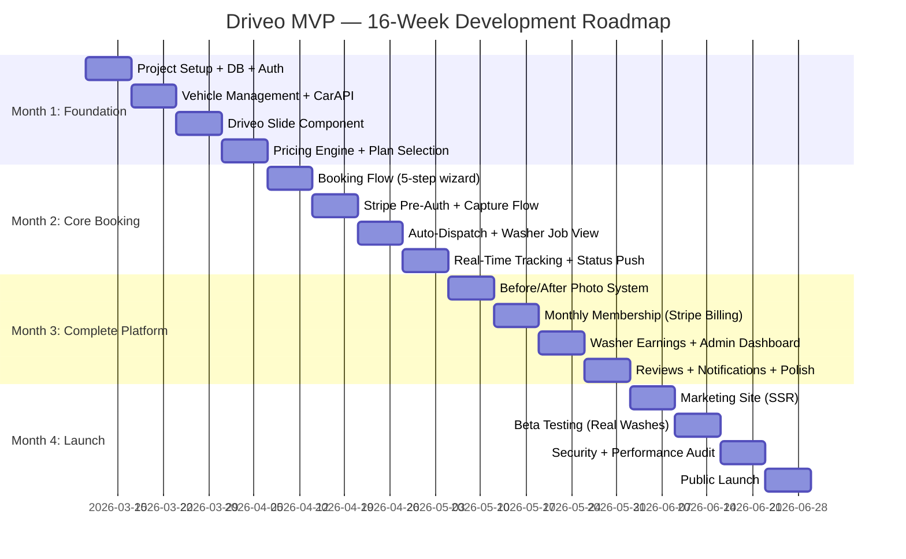

# DRIVEO — Complete System Architecture & Technical Plan
## "Uber for Car Washing" — Pre-Build Architecture Document
**Version 1.0 | March 2026 | driveo.ca**

---

## 1. PRODUCT OVERVIEW

Driveo is a two-sided marketplace for on-demand and scheduled car washing in the GTA. The experience mirrors Uber: customer opens app → selects vehicle → picks plan → sets dirt level via the **Driveo Slide** → confirms booking → nearest washer is auto-assigned → customer tracks washer in real-time → washer completes job with before/after photos → payment captured automatically.

**What makes Driveo unique**: The **Driveo Slide** — a visual dirt level slider (0-10) that applies a real-time dirt overlay on the customer's actual car image (fetched by make/model/year). This solves the industry problem where customers don't want to share photos of their dirty car, and washers need to estimate the dirt level for accurate pricing and time.

---

## 2. PRODUCT ARCHITECTURE & MODULES

### 2.1 Module Map

| Module | Route Segment | Description | User |
|---|---|---|---|
| **Marketing** | `/(marketing)/*` | SEO-optimized public pages, plan comparison, local landing pages | Public |
| **Customer App** | `/app/*` | Booking with Driveo Slide, vehicle profiles, live washer tracking, subscriptions | Customer |
| **Washer App** | `/washer/*` | Job queue, status updates, before/after photo upload, earnings dashboard | Washer |
| **Admin Dashboard** | `/admin/*` | Platform management: bookings, washers, customers, pricing, payouts | Admin |
| **API Layer** | `/api/*` | Next.js Route Handlers — all business logic, webhooks, integrations | Internal |

### 2.2 Cross-Cutting Concerns

| Concern | Implementation |
|---|---|
| **Authentication** | Supabase Auth (email/phone OTP), JWT tokens, role-based routing |
| **Authorization** | Supabase RLS on every table + server-side role checks in API routes |
| **Payments** | Stripe: pre-authorize on booking, capture after wash completion (Uber model) |
| **Washer Payouts** | Stripe Connect: flat-rate per wash type ($11 or $22) |
| **Notifications** | Tri-channel: in-app (DB), SMS (Twilio), email (Resend) |
| **File Storage** | Supabase Storage (private buckets, signed URLs for photos) |
| **Maps & Tracking** | Google Maps API (autocomplete + live washer GPS tracking) |
| **Vehicle Images** | CarAPI / CarsXE API (fetch car image by make/model/year for Driveo Slide) |
| **Error Monitoring** | Sentry |

---

## 3. PRICING MODEL

### 3.1 Wash Plans

| Plan | Price (Base) | What's Included | Washer Payout | Driveo Keeps | Est. Duration (Sedan) |
|---|---|---|---|---|---|
| **Regular** | $18 | Exterior wash only | $11 | $7 | 30-45 min |
| **Interior & Exterior** | $25 | Full interior + exterior wash | $11 | $14 | 60-90 min |
| **Detailing** | $189 | Deep clean, polish, wax, interior detail | $22 | $167 | 3-5 hours |

### 3.2 Vehicle Type Multipliers

Larger vehicles cost more due to increased surface area, time, and product usage.

| Vehicle Type | Multiplier | Regular | I&E | Detailing |
|---|---|---|---|---|
| Sedan / Coupe | 1.0x | $18 | $25 | $189 |
| Crossover | 1.15x | $20.70 | $28.75 | $217.35 |
| SUV | 1.25x | $22.50 | $31.25 | $236.25 |
| Minivan | 1.25x | $22.50 | $31.25 | $236.25 |
| Pickup Truck | 1.20x | $21.60 | $30.00 | $226.80 |
| Large SUV / Truck | 1.40x | $25.20 | $35.00 | $264.60 |

### 3.3 Dirt Level Multipliers (Driveo Slide)

The Driveo Slide ranges from 0 (just washed) to 10 (extreme dirt/mud). Levels 0-5 are the base price — no surcharge. Levels 6-10 apply an increasing multiplier because dirtier cars require more time, water, and product.

| Dirt Level | Multiplier | Description | Regular (Sedan) | I&E (Sedan) |
|---|---|---|---|---|
| 0-5 | 1.0x | Light to normal dirt | $18.00 | $25.00 |
| 6 | 1.15x | Moderately dirty | $20.70 | $28.75 |
| 7 | 1.30x | Dirty | $23.40 | $32.50 |
| 8 | 1.50x | Very dirty | $27.00 | $37.50 |
| 9 | 1.75x | Heavily soiled | $31.50 | $43.75 |
| 10 | 2.0x | Extreme (mud, heavy grime) | $36.00 | $50.00 |

### 3.4 Price Formula

```
Final Price = Plan Base Price × Vehicle Type Multiplier × Dirt Level Multiplier
```

**Example**: Interior & Exterior wash for an SUV at dirt level 8:
```
$25 × 1.25 × 1.50 = $46.88 (rounded to $46.90)
```

### 3.5 Monthly Membership

8 washes per month at a discounted rate based on chosen plan.

| Membership | Monthly Price | Per-Wash Value | Savings vs. Pay-Per-Wash |
|---|---|---|---|
| **Regular Monthly** | $119/mo | $14.88/wash | 17% savings |
| **I&E Monthly** | $159/mo | $19.88/wash | 20% savings |
| **Detailing Monthly** | $999/mo | $124.88/wash | 34% savings |

- Includes 8 washes at base dirt level (0-5). Dirt surcharges above level 5 still apply per wash.
- Vehicle type multiplier is baked into the membership price based on the primary vehicle at signup.
- Booking types: **Instant** (next available washer) or **Scheduled** (pick date/time)
- No rollover — unused washes expire at period end
- Cancel anytime, effective at period end

### 3.6 Washer Payout Structure

Washers receive a **flat rate per wash**, regardless of dirt surcharges or vehicle multipliers. This keeps the model simple and predictable for washers.

| Wash Type | Washer Gets | Notes |
|---|---|---|
| Regular | $11 | Per completed wash |
| Interior & Exterior | $11 | Per completed wash |
| Detailing | $22 | Per completed wash |

Payouts processed weekly via Stripe Connect.

---

## 4. THE DRIVEO SLIDE — TECHNICAL SPECIFICATION

### 4.1 What It Is

The Driveo Slide is a visual slider component (0-10) that:
1. Fetches the customer's actual car image based on their selected make/model/year
2. Displays the car in a styled container
3. As the slider moves from 0→10, progressively applies a **dirt overlay effect** to the car image
4. Shows live price and estimated time updates as the slider moves

This solves the industry problem: customers resist sharing photos of their dirty car, but washers need dirt level info for pricing. The slider lets customers self-report dirt level with a visual reference.

### 4.2 Car Image Sourcing

```
User selects: Year → Make → Model
                ↓
API call: GET /api/vehicle-image?year=2022&make=Honda&model=CR-V
                ↓
Backend: Call CarAPI (carapi.app) or CarsXE API
                ↓
Response: High-res PNG/JPG of that specific car model
                ↓
Display: Image loaded into Driveo Slide canvas
```

**API Options**:
- **CarAPI** (carapi.app) — Free tier, developer-friendly, good coverage
- **CarsXE** (api.carsxe.com) — Millions of vehicles, search by make/model/year
- **Fallback**: Curated library of ~50 common car images (covers 80% of GTA market)

### 4.3 Dirt Overlay Effect — Technical Implementation

The dirt effect uses **HTML Canvas** with layered texture overlays:

```
┌─────────────────────────────────────────┐
│           DRIVEO SLIDE STACK             │
├─────────────────────────────────────────┤
│                                          │
│  Layer 4: Mud splatter texture (PNG)     │  ← opacity: slider > 7 ? (slider-7)/3 : 0
│  Layer 3: Heavy dust texture (PNG)       │  ← opacity: slider > 4 ? (slider-4)/6 : 0
│  Layer 2: Light dust/film texture (PNG)  │  ← opacity: slider/10
│  Layer 1: Car image (from API)           │  ← base layer, always full opacity
│                                          │
│  Blend mode: multiply (all overlays)     │
│  Canvas size: responsive, max 600x400    │
│                                          │
└─────────────────────────────────────────┘
```

**Implementation approach**:

```typescript
// Simplified Driveo Slide rendering logic
function renderDriveoSlide(carImage: HTMLImageElement, dirtLevel: number) {
  const canvas = document.getElementById('driveo-slide') as HTMLCanvasElement;
  const ctx = canvas.getContext('2d')!;

  // Layer 1: Draw car image
  ctx.clearRect(0, 0, canvas.width, canvas.height);
  ctx.drawImage(carImage, 0, 0, canvas.width, canvas.height);

  // Layer 2: Light dust film (visible from level 1+)
  ctx.globalCompositeOperation = 'multiply';
  ctx.globalAlpha = Math.min(dirtLevel / 10, 1);
  ctx.drawImage(lightDustTexture, 0, 0, canvas.width, canvas.height);

  // Layer 3: Heavy dust/dirt (visible from level 5+)
  ctx.globalAlpha = dirtLevel > 4 ? (dirtLevel - 4) / 6 : 0;
  ctx.drawImage(heavyDirtTexture, 0, 0, canvas.width, canvas.height);

  // Layer 4: Mud splatters (visible from level 8+)
  ctx.globalAlpha = dirtLevel > 7 ? (dirtLevel - 7) / 3 : 0;
  ctx.drawImage(mudSplatterTexture, 0, 0, canvas.width, canvas.height);

  // Reset
  ctx.globalCompositeOperation = 'source-over';
  ctx.globalAlpha = 1;
}
```

**Dirt texture assets needed** (3 PNG files with transparency):
1. `dust-light.png` — Subtle dusty film, semi-transparent brownish tint
2. `dirt-heavy.png` — Heavier dirt patches, dust accumulation pattern
3. `mud-splatter.png` — Mud spots, road grime, heavy splatter marks

**Alternative approach**: CSS filters + overlay divs (simpler but less realistic):
```css
.dirt-overlay {
  mix-blend-mode: multiply;
  opacity: var(--dirt-level); /* 0 to 1, mapped from slider 0-10 */
  background-image: url('/textures/dirt-overlay.png');
}
```

### 4.4 Driveo Slide UI Component

```
┌─────────────────────────────────────────────────────┐
│                                                      │
│              ┌──────────────────────┐               │
│              │                      │               │
│              │   [Car Image with    │               │
│              │    dirt overlay]      │               │
│              │                      │               │
│              │   2022 Honda CR-V    │               │
│              └──────────────────────┘               │
│                                                      │
│     0 ●━━━━━━━━━━━━━━━━●─────────────── 10          │
│       Clean            ▲              Extreme       │
│                     Level 6                          │
│                  "Moderately dirty"                  │
│                                                      │
│     ┌──────────────────────────────────────┐        │
│     │  Regular Wash        $20.70          │        │
│     │  Interior & Ext.     $28.75          │        │
│     │  Detailing           $217.35         │        │
│     │                                      │        │
│     │  Est. time: 35-50 min (Regular)      │        │
│     └──────────────────────────────────────┘        │
│                                                      │
└─────────────────────────────────────────────────────┘
```

As the slider moves:
- Car image gets progressively dirtier (canvas re-renders)
- Price updates live for all three plans
- Estimated time adjusts
- Dirt level label updates ("Clean", "Light dust", "Normal", "Moderately dirty", "Dirty", "Very dirty", "Heavily soiled", "Extreme")

---

## 5. CORE USER FLOWS

### 5.1 Customer Booking Flow (Uber-Style)

The entire booking is completable in **under 60 seconds** for returning users:

```
STEP 1: VEHICLE
┌─────────────────────────────────┐
│  What car are you washing?       │
│                                  │
│  Year: [2022 ▼]                 │
│  Make: [Honda ▼]                │
│  Model: [CR-V ▼]               │
│                                  │
│  ── or select saved vehicle ──  │
│  ┌──────┐  ┌──────┐            │
│  │ My    │  │ Wife's│ + Add    │
│  │ CR-V  │  │ Civic │  New     │
│  └──────┘  └──────┘            │
│                                  │
│  [Continue →]                    │
└─────────────────────────────────┘
          ↓
STEP 2: LOCATION
┌─────────────────────────────────┐
│  Where is your car?              │
│                                  │
│  📍 [123 Erin Mills Pkwy___]   │
│     (Google autocomplete)        │
│                                  │
│  ── or use saved address ──     │
│  [🏠 Home] [💼 Office]          │
│                                  │
│  [Continue →]                    │
└─────────────────────────────────┘
          ↓
STEP 3: DRIVEO SLIDE + PLAN SELECTION
┌─────────────────────────────────┐
│  How dirty is your car?          │
│                                  │
│  ┌────────────────────┐         │
│  │  [Car with dirt     │         │
│  │   overlay effect]   │         │
│  └────────────────────┘         │
│                                  │
│  0 ━━━━━━━━●─────────── 10      │
│  Clean    Lvl 5      Extreme    │
│                                  │
│  ── Select your plan ──         │
│  ┌────────┐┌────────┐┌────────┐│
│  │Regular ││ I & E  ││Detail  ││
│  │$18.00  ││$25.00  ││$189.00 ││
│  │Exterior││Full    ││Premium ││
│  │30 min  ││60 min  ││3+ hrs  ││
│  └────────┘└────────┘└────────┘│
│                                  │
│  [Continue →]                    │
└─────────────────────────────────┘
          ↓
STEP 4: WHEN
┌─────────────────────────────────┐
│  When do you want it?            │
│                                  │
│  [⚡ Now]    [📅 Schedule]       │
│                                  │
│  If "Now": Next available washer │
│  If "Schedule": Calendar + time  │
│                                  │
│  [Continue →]                    │
└─────────────────────────────────┘
          ↓
STEP 5: CONFIRM & PRE-AUTHORIZE
┌─────────────────────────────────┐
│  Confirm your booking            │
│                                  │
│  🚗 2022 Honda CR-V (SUV)       │
│  📍 123 Erin Mills Pkwy         │
│  🧽 Interior & Exterior         │
│  📊 Dirt level: 5 (Normal)      │
│  ⏰ Now — next available         │
│                                  │
│  ─────────────────────────────  │
│  Wash price          $31.25     │
│  HST (13%)           $4.06      │
│  Total               $35.31     │
│                                  │
│  💳 Visa ****4242     [Change]  │
│                                  │
│  ℹ️  Your card will be pre-      │
│  authorized. Payment captured    │
│  only after wash is complete.    │
│                                  │
│  [Confirm Booking →]             │
└─────────────────────────────────┘
```

### 5.2 Post-Booking: Real-Time Status (Customer View)



**Customer status screen (like Uber driver tracking)**:
```
┌─────────────────────────────────┐
│  ← Back        Booking #1042    │
├─────────────────────────────────┤
│                                  │
│  🟢 WASHER EN ROUTE              │
│  Rahul K. is on the way          │
│  ★ 4.9 · 147 washes             │
│  📞 Call  💬 Message             │
│                                  │
│  ┌────────────────────────┐     │
│  │                        │     │
│  │   [GOOGLE MAP]         │     │
│  │   Live washer dot 📍   │     │
│  │   moving toward you    │     │
│  │                        │     │
│  └────────────────────────┘     │
│  ETA: ~12 minutes               │
│                                  │
│  STATUS TIMELINE:                │
│  ✅ Booking confirmed   2:23 PM │
│  ✅ Washer assigned     2:24 PM │
│  ✅ Washer en route     2:26 PM │
│  ⏳ Washer arrived      —       │
│  ○  Wash in progress    —       │
│  ○  Complete            —       │
│                                  │
│  🚗 2022 Honda CR-V              │
│  🧽 Interior & Exterior          │
│  💰 $35.31 (pre-authorized)     │
└─────────────────────────────────┘
```

### 5.3 Washer Job Flow

```
┌─────────────────────────────────────────────────────────────────┐
│                         WASHER FLOW                              │
├─────────────────────────────────────────────────────────────────┤
│                                                                  │
│  1. RECEIVE JOB       → Push notification + SMS                  │
│     "New wash request: I&E, SUV, 3.2 km away, $11 payout"      │
│     [Accept] [Decline] — 30 sec countdown to accept              │
│                                                                  │
│  2. TAP "ON MY WAY"   → Customer sees live GPS on map            │
│                                                                  │
│  3. TAP "ARRIVED"     → Customer gets notification               │
│                                                                  │
│  4. TAKE BEFORE PHOTOS → 5 angles: front, rear, left, right,   │
│                          interior. Camera opens, auto-uploads.   │
│                                                                  │
│  5. TAP "START WASH"  → Timer starts, customer sees "In Progress"│
│                                                                  │
│  6. DO THE WASH        → (Physical work happens)                 │
│                                                                  │
│  7. TAKE AFTER PHOTOS  → Same 5 angles. Upload required.        │
│     "Mark Complete" button LOCKED until 5+ after photos uploaded │
│                                                                  │
│  8. TAP "COMPLETE"    → Payment captured from customer's card    │
│                       → Washer earnings credited ($11 or $22)    │
│                       → Customer gets "Your wash is done!" SMS   │
│                       → Before/after photos visible to customer  │
│                                                                  │
└─────────────────────────────────────────────────────────────────┘
```

### 5.4 Admin Flow

```
DAILY:
  1. Monitor dashboard KPIs (revenue, active washes, washers online)
  2. Handle escalations/disputes
  3. Review new washer applications (approve/reject)

WEEKLY:
  4. Review washer performance metrics
  5. Payout processing happens automatically via Stripe Connect

MONTHLY:
  6. Adjust pricing if needed
  7. Review subscription metrics
```

---

## 6. SYSTEM ARCHITECTURE

### 6.1 High-Level Architecture Diagram



### 6.2 Booking Request Flow



---

## 7. DATABASE ARCHITECTURE

### 7.1 Entity Relationship Diagram

```mermaid
erDiagram
    AUTH_USERS ||--|| PROFILES : "extends"
    PROFILES ||--o| CUSTOMER_PROFILES : "if customer"
    PROFILES ||--o| WASHER_PROFILES : "if washer"

    CUSTOMER_PROFILES ||--o{ VEHICLES : "owns"
    CUSTOMER_PROFILES ||--o| SUBSCRIPTIONS : "subscribes"

    PROFILES ||--o{ BOOKINGS : "customer books"
    PROFILES ||--o{ BOOKINGS : "washer serves"
    VEHICLES ||--o{ BOOKINGS : "for vehicle"

    BOOKINGS ||--o{ BOOKING_PHOTOS : "has photos"
    BOOKINGS ||--o| REVIEWS : "reviewed"

    SUBSCRIPTION_PLANS ||--o{ SUBSCRIPTIONS : "plan"
    SUBSCRIPTIONS ||--o{ SUBSCRIPTION_USAGE : "usage tracking"

    PROFILES ||--o{ WASHER_AVAILABILITY : "schedule"
    PROFILES ||--o{ NOTIFICATIONS : "receives"

    PROFILES {
        uuid id PK
        text role "customer | washer | admin"
        text full_name
        text phone
        text email
        text avatar_url
        timestamptz created_at
    }

    CUSTOMER_PROFILES {
        uuid id PK_FK
        text default_address
        numeric default_lat
        numeric default_lng
        text default_postal
        text referral_code
        uuid subscription_id FK
        text stripe_customer_id
    }

    WASHER_PROFILES {
        uuid id PK_FK
        text status "pending | approved | suspended"
        text[] service_zones "postal prefixes"
        text stripe_account_id "Stripe Connect"
        numeric rating_avg
        int jobs_completed
        boolean is_online
        numeric current_lat "live GPS"
        numeric current_lng "live GPS"
        timestamptz location_updated_at
    }

    VEHICLES {
        uuid id PK
        uuid customer_id FK
        text make
        text model
        int year
        text color
        text type "sedan | suv | pickup | etc"
        text image_url "cached from CarAPI"
        boolean is_primary
    }

    BOOKINGS {
        uuid id PK
        uuid customer_id FK
        uuid washer_id FK "null until assigned"
        uuid vehicle_id FK
        text wash_plan "regular | interior_exterior | detailing"
        int dirt_level "0-10 from Driveo Slide"
        text status "pending → assigned → en_route → arrived → washing → completed → paid"
        text service_address
        numeric service_lat
        numeric service_lng
        boolean is_instant "true=ASAP false=scheduled"
        timestamptz scheduled_at
        int base_price "plan price in cents"
        numeric vehicle_multiplier
        numeric dirt_multiplier
        int final_price "in cents"
        int washer_payout "in cents 1100 or 2200"
        text payment_status "pending | authorized | captured | refunded"
        text stripe_payment_intent_id
        timestamptz washer_en_route_at
        timestamptz washer_arrived_at
        timestamptz wash_started_at
        timestamptz wash_completed_at
        timestamptz payment_captured_at
    }

    BOOKING_PHOTOS {
        uuid id PK
        uuid booking_id FK
        uuid washer_id FK
        text photo_type "before | after"
        text storage_path
        text angle_label "front | rear | left | right | interior"
        timestamptz created_at
    }

    REVIEWS {
        uuid id PK
        uuid booking_id FK
        uuid customer_id FK
        uuid washer_id FK
        int rating "1-5"
        text comment
        timestamptz created_at
    }

    SUBSCRIPTION_PLANS {
        uuid id PK
        text name "Regular Monthly | I&E Monthly | Detailing Monthly"
        text slug
        text wash_plan "regular | interior_exterior | detailing"
        int monthly_price "in cents"
        int washes_per_month "8"
        text stripe_price_id
    }

    SUBSCRIPTIONS {
        uuid id PK
        uuid customer_id FK
        uuid plan_id FK
        text stripe_subscription_id
        text status "active | paused | past_due | cancelled"
        timestamptz current_period_start
        timestamptz current_period_end
    }

    SUBSCRIPTION_USAGE {
        uuid id PK
        uuid subscription_id FK
        timestamptz period_start
        timestamptz period_end
        int allocated "8"
        int used "washes completed this period"
    }

    WASHER_AVAILABILITY {
        uuid id PK
        uuid washer_id FK
        int day_of_week "0=Sun 6=Sat"
        time start_time
        time end_time
        boolean is_available
    }

    NOTIFICATIONS {
        uuid id PK
        uuid user_id FK
        text type
        text title
        text body
        jsonb data
        boolean is_read
        timestamptz created_at
    }
```

### 7.2 Complete SQL Schema

```sql
-- ═══════════════════════════════════════
-- PROFILES (extends Supabase auth.users)
-- ═══════════════════════════════════════

CREATE TABLE public.profiles (
  id          uuid PRIMARY KEY REFERENCES auth.users(id) ON DELETE CASCADE,
  role        text NOT NULL CHECK (role IN ('customer', 'washer', 'admin')),
  full_name   text NOT NULL,
  phone       text,
  email       text,
  avatar_url  text,
  created_at  timestamptz DEFAULT now(),
  updated_at  timestamptz DEFAULT now()
);

CREATE TABLE public.customer_profiles (
  id                uuid PRIMARY KEY REFERENCES public.profiles(id) ON DELETE CASCADE,
  default_address   text,
  default_lat       numeric(10,7),
  default_lng       numeric(10,7),
  default_postal    text,
  referral_code     text UNIQUE,
  referred_by       uuid REFERENCES public.profiles(id),
  subscription_id   uuid,
  stripe_customer_id text,
  created_at        timestamptz DEFAULT now()
);

CREATE TABLE public.washer_profiles (
  id                    uuid PRIMARY KEY REFERENCES public.profiles(id) ON DELETE CASCADE,
  status                text NOT NULL DEFAULT 'pending'
                          CHECK (status IN ('pending','approved','suspended','rejected')),
  bio                   text,
  service_zones         text[],           -- postal code prefixes: {"L4Z","L5B","M9C"}
  vehicle_make          text,
  vehicle_model         text,
  vehicle_year          int,
  vehicle_plate         text,
  tools_owned           text[],
  insurance_verified    boolean DEFAULT false,
  background_check_done boolean DEFAULT false,
  stripe_account_id     text,             -- Stripe Connect Express
  rating_avg            numeric(3,2) DEFAULT 0,
  jobs_completed        int DEFAULT 0,
  is_online             boolean DEFAULT false,
  current_lat           numeric(10,7),
  current_lng           numeric(10,7),
  location_updated_at   timestamptz,
  created_at            timestamptz DEFAULT now()
);

-- ═══════════════════════════════════════
-- VEHICLES
-- ═══════════════════════════════════════

CREATE TABLE public.vehicles (
  id           uuid PRIMARY KEY DEFAULT gen_random_uuid(),
  customer_id  uuid NOT NULL REFERENCES public.profiles(id) ON DELETE CASCADE,
  make         text NOT NULL,
  model        text NOT NULL,
  year         int NOT NULL,
  color        text,
  plate        text,
  type         text NOT NULL CHECK (type IN (
                 'sedan','coupe','suv','crossover',
                 'minivan','pickup','large_suv','convertible'
               )),
  image_url    text,                      -- cached car image from CarAPI
  is_primary   boolean DEFAULT false,
  nickname     text,
  created_at   timestamptz DEFAULT now()
);

-- ═══════════════════════════════════════
-- BOOKINGS
-- ═══════════════════════════════════════

CREATE TABLE public.bookings (
  id                      uuid PRIMARY KEY DEFAULT gen_random_uuid(),
  customer_id             uuid NOT NULL REFERENCES public.profiles(id),
  washer_id               uuid REFERENCES public.profiles(id),
  vehicle_id              uuid NOT NULL REFERENCES public.vehicles(id),

  wash_plan               text NOT NULL CHECK (wash_plan IN (
                            'regular', 'interior_exterior', 'detailing'
                          )),
  dirt_level              int NOT NULL CHECK (dirt_level BETWEEN 0 AND 10),

  status                  text NOT NULL DEFAULT 'pending' CHECK (status IN (
                            'pending',       -- just created, searching for washer
                            'assigned',      -- washer found, awaiting acceptance
                            'en_route',      -- washer driving to customer
                            'arrived',       -- washer at location
                            'washing',       -- wash in progress
                            'completed',     -- wash done, photos uploaded
                            'paid',          -- payment captured
                            'cancelled',     -- cancelled
                            'disputed'       -- issue raised
                          )),

  -- Location
  service_address         text NOT NULL,
  service_lat             numeric(10,7) NOT NULL,
  service_lng             numeric(10,7) NOT NULL,
  location_notes          text,

  -- Scheduling
  is_instant              boolean DEFAULT true,
  scheduled_at            timestamptz,
  estimated_duration_min  int,

  -- Pricing (all in cents)
  base_price              int NOT NULL,     -- plan base price
  vehicle_multiplier      numeric(4,2) NOT NULL DEFAULT 1.00,
  dirt_multiplier         numeric(4,2) NOT NULL DEFAULT 1.00,
  final_price             int NOT NULL,     -- base × vehicle × dirt
  hst_amount              int NOT NULL,     -- 13% HST
  total_price             int NOT NULL,     -- final + HST
  washer_payout           int NOT NULL,     -- 1100 or 2200 (cents)

  -- Payment
  payment_status          text DEFAULT 'pending' CHECK (payment_status IN (
                            'pending','authorized','captured','refunded','failed'
                          )),
  stripe_payment_intent_id text,

  -- Subscription (if booking from membership)
  subscription_id         uuid REFERENCES public.subscriptions(id),

  -- Timestamps
  washer_assigned_at      timestamptz,
  washer_en_route_at      timestamptz,
  washer_arrived_at       timestamptz,
  wash_started_at         timestamptz,
  wash_completed_at       timestamptz,
  payment_captured_at     timestamptz,

  customer_notes          text,
  created_at              timestamptz DEFAULT now(),
  updated_at              timestamptz DEFAULT now()
);

-- ═══════════════════════════════════════
-- PHOTOS
-- ═══════════════════════════════════════

CREATE TABLE public.booking_photos (
  id           uuid PRIMARY KEY DEFAULT gen_random_uuid(),
  booking_id   uuid NOT NULL REFERENCES public.bookings(id) ON DELETE CASCADE,
  washer_id    uuid NOT NULL REFERENCES public.profiles(id),
  photo_type   text NOT NULL CHECK (photo_type IN ('before','after')),
  storage_path text NOT NULL,
  angle_label  text CHECK (angle_label IN (
                 'front','rear','driver_side','passenger_side','interior'
               )),
  created_at   timestamptz DEFAULT now()
);

-- ═══════════════════════════════════════
-- REVIEWS
-- ═══════════════════════════════════════

CREATE TABLE public.reviews (
  id            uuid PRIMARY KEY DEFAULT gen_random_uuid(),
  booking_id    uuid NOT NULL UNIQUE REFERENCES public.bookings(id),
  customer_id   uuid NOT NULL REFERENCES public.profiles(id),
  washer_id     uuid NOT NULL REFERENCES public.profiles(id),
  rating        int NOT NULL CHECK (rating BETWEEN 1 AND 5),
  comment       text,
  created_at    timestamptz DEFAULT now()
);

-- ═══════════════════════════════════════
-- SUBSCRIPTIONS
-- ═══════════════════════════════════════

CREATE TABLE public.subscription_plans (
  id                uuid PRIMARY KEY DEFAULT gen_random_uuid(),
  name              text NOT NULL,
  slug              text UNIQUE NOT NULL,
  wash_plan         text NOT NULL CHECK (wash_plan IN (
                      'regular', 'interior_exterior', 'detailing'
                    )),
  monthly_price     int NOT NULL,          -- in cents
  washes_per_month  int NOT NULL DEFAULT 8,
  stripe_price_id   text,
  description       text,
  is_active         boolean DEFAULT true,
  display_order     int DEFAULT 0
);

CREATE TABLE public.subscriptions (
  id                       uuid PRIMARY KEY DEFAULT gen_random_uuid(),
  customer_id              uuid NOT NULL REFERENCES public.profiles(id),
  plan_id                  uuid NOT NULL REFERENCES public.subscription_plans(id),
  vehicle_id               uuid NOT NULL REFERENCES public.vehicles(id),
  stripe_subscription_id   text NOT NULL UNIQUE,
  status                   text NOT NULL DEFAULT 'active' CHECK (status IN (
                              'active','paused','past_due','cancelled'
                            )),
  current_period_start     timestamptz,
  current_period_end       timestamptz,
  cancel_at_period_end     boolean DEFAULT false,
  created_at               timestamptz DEFAULT now(),
  cancelled_at             timestamptz
);

CREATE TABLE public.subscription_usage (
  id              uuid PRIMARY KEY DEFAULT gen_random_uuid(),
  subscription_id uuid NOT NULL REFERENCES public.subscriptions(id),
  period_start    timestamptz NOT NULL,
  period_end      timestamptz NOT NULL,
  allocated       int NOT NULL DEFAULT 8,
  used            int DEFAULT 0,
  UNIQUE (subscription_id, period_start)
);

-- ═══════════════════════════════════════
-- WASHER AVAILABILITY
-- ═══════════════════════════════════════

CREATE TABLE public.washer_availability (
  id           uuid PRIMARY KEY DEFAULT gen_random_uuid(),
  washer_id    uuid NOT NULL REFERENCES public.profiles(id),
  day_of_week  int NOT NULL CHECK (day_of_week BETWEEN 0 AND 6),
  start_time   time NOT NULL,
  end_time     time NOT NULL,
  is_available boolean DEFAULT true
);

CREATE TABLE public.washer_blocks (
  id           uuid PRIMARY KEY DEFAULT gen_random_uuid(),
  washer_id    uuid NOT NULL REFERENCES public.profiles(id),
  blocked_from timestamptz NOT NULL,
  blocked_to   timestamptz NOT NULL,
  reason       text
);

-- ═══════════════════════════════════════
-- NOTIFICATIONS
-- ═══════════════════════════════════════

CREATE TABLE public.notifications (
  id         uuid PRIMARY KEY DEFAULT gen_random_uuid(),
  user_id    uuid NOT NULL REFERENCES public.profiles(id),
  type       text NOT NULL,
  title      text NOT NULL,
  body       text NOT NULL,
  data       jsonb,
  is_read    boolean DEFAULT false,
  created_at timestamptz DEFAULT now()
);

-- ═══════════════════════════════════════
-- SERVICE ZONES
-- ═══════════════════════════════════════

CREATE TABLE public.service_zones (
  id              uuid PRIMARY KEY DEFAULT gen_random_uuid(),
  name            text NOT NULL,
  postal_prefixes text[] NOT NULL,
  is_active       boolean DEFAULT true,
  launch_date     date
);

-- ═══════════════════════════════════════
-- INDEXES
-- ═══════════════════════════════════════

CREATE INDEX idx_bookings_customer ON bookings(customer_id);
CREATE INDEX idx_bookings_washer ON bookings(washer_id);
CREATE INDEX idx_bookings_status ON bookings(status);
CREATE INDEX idx_bookings_scheduled ON bookings(scheduled_at);
CREATE INDEX idx_booking_photos_booking ON booking_photos(booking_id);
CREATE INDEX idx_notifications_user_unread ON notifications(user_id) WHERE is_read = false;
CREATE INDEX idx_subscriptions_customer ON subscriptions(customer_id);
CREATE INDEX idx_washer_availability_washer ON washer_availability(washer_id);
CREATE INDEX idx_washer_profiles_online ON washer_profiles(is_online) WHERE is_online = true;
CREATE INDEX idx_washer_profiles_location ON washer_profiles(current_lat, current_lng) WHERE is_online = true;
CREATE INDEX idx_vehicles_customer ON vehicles(customer_id);
```

### 7.3 RLS Policy Summary

```sql
-- profiles: users read/update own row only; admin reads all
-- customer_profiles: customer reads/updates own; admin reads all
-- washer_profiles: washer reads/updates own; admin reads all; dispatch reads online washers
-- vehicles: customer CRUD own; washer reads vehicle for assigned booking
-- bookings: customer reads own; washer reads assigned; admin reads all
-- booking_photos: washer inserts for assigned job; customer reads own booking; admin reads all
-- reviews: customer inserts once per booking; public reads
-- subscriptions: customer reads own; admin reads all
-- notifications: user reads own only
```

---

## 8. BACKEND SERVICE ARCHITECTURE

### 8.1 Service Map



### 8.2 Auto-Dispatch Algorithm

The dispatch system mirrors Uber's approach — fully automated, nearest available washer:

```typescript
// lib/dispatch.ts — simplified logic
async function findAndAssignWasher(booking: Booking): Promise<Washer | null> {
  // 1. Find online washers in the service zone
  const onlineWashers = await supabase
    .from('washer_profiles')
    .select('*')
    .eq('is_online', true)
    .eq('status', 'approved');

  // 2. Filter by service zone (postal prefix match)
  const inZone = onlineWashers.filter(w =>
    w.service_zones.some(zone => booking.service_postal.startsWith(zone))
  );

  // 3. Filter by availability (current day/time)
  const available = await filterByAvailability(inZone, booking.scheduled_at);

  // 4. Filter out washers with active jobs
  const free = await filterByActiveJobs(available);

  // 5. Sort by distance (Haversine formula)
  const sorted = free.sort((a, b) =>
    haversineDistance(a.current_lat, a.current_lng, booking.service_lat, booking.service_lng) -
    haversineDistance(b.current_lat, b.current_lng, booking.service_lat, booking.service_lng)
  );

  // 6. Assign nearest washer
  if (sorted.length === 0) return null;

  const nearest = sorted[0];
  await supabase
    .from('bookings')
    .update({
      washer_id: nearest.id,
      status: 'assigned',
      washer_assigned_at: new Date().toISOString()
    })
    .eq('id', booking.id);

  // 7. Notify washer (SMS + push)
  await sendWasherJobNotification(nearest, booking);

  return nearest;
}
```

**Retry logic**: If no washer available, retry every 60 seconds for 15 minutes with expanding search radius. If still no match, notify customer + admin.

### 8.3 Pricing Engine

```typescript
// lib/pricing.ts

const PLAN_PRICES = {
  regular: 1800,            // $18.00 in cents
  interior_exterior: 2500,  // $25.00
  detailing: 18900,         // $189.00
} as const;

const VEHICLE_MULTIPLIERS = {
  sedan: 1.0, coupe: 1.0, convertible: 1.0,
  crossover: 1.15,
  suv: 1.25, minivan: 1.25,
  pickup: 1.20,
  large_suv: 1.40,
} as const;

const DIRT_MULTIPLIERS: Record<number, number> = {
  0: 1.0, 1: 1.0, 2: 1.0, 3: 1.0, 4: 1.0, 5: 1.0,
  6: 1.15, 7: 1.30, 8: 1.50, 9: 1.75, 10: 2.0,
};

const WASHER_PAYOUTS = {
  regular: 1100,            // $11.00
  interior_exterior: 1100,  // $11.00
  detailing: 2200,          // $22.00
} as const;

const HST_RATE = 0.13;

function calculatePrice(
  plan: WashPlan,
  vehicleType: VehicleType,
  dirtLevel: number
): PriceBreakdown {
  const base = PLAN_PRICES[plan];
  const vehicleMult = VEHICLE_MULTIPLIERS[vehicleType];
  const dirtMult = DIRT_MULTIPLIERS[dirtLevel] ?? 1.0;

  const finalPrice = Math.round(base * vehicleMult * dirtMult);
  const hst = Math.round(finalPrice * HST_RATE);
  const total = finalPrice + hst;
  const washerPayout = WASHER_PAYOUTS[plan];

  return { base, vehicleMult, dirtMult, finalPrice, hst, total, washerPayout };
}
```

---

## 9. API STRUCTURE

### 9.1 Complete Route Map

```
Authentication
├── POST /api/auth/signup               → Create customer profile
├── POST /api/auth/washer-signup        → Create washer profile (status=pending)
└── POST /api/auth/logout               → End session

Vehicle Image (Driveo Slide)
└── GET  /api/vehicle-image?year=X&make=Y&model=Z → Fetch car image from CarAPI

Vehicles
├── GET    /api/vehicles                → Customer's saved vehicles
├── POST   /api/vehicles                → Add vehicle
├── PATCH  /api/vehicles/[id]           → Update vehicle
└── DELETE /api/vehicles/[id]           → Remove vehicle

Pricing (client-side calculation, server validates)
└── POST /api/pricing/calculate         → Validate price: {plan, vehicleType, dirtLevel}

Bookings
├── POST   /api/bookings                → Create booking + Stripe pre-auth + auto-dispatch
├── GET    /api/bookings                → Customer's bookings (paginated)
├── GET    /api/bookings/[id]           → Booking detail with washer info
├── PATCH  /api/bookings/[id]/cancel    → Cancel booking
├── POST   /api/bookings/[id]/photos    → Upload before/after photo (washer)
└── GET    /api/bookings/[id]/photos    → Get signed photo URLs

Washer
├── GET    /api/washer/dashboard        → Today's stats + active job
├── GET    /api/washer/jobs             → Job list (active, upcoming, completed)
├── PATCH  /api/washer/jobs/[id]/accept → Accept job (30s countdown)
├── PATCH  /api/washer/jobs/[id]/decline → Decline job (re-dispatch)
├── PATCH  /api/washer/jobs/[id]/status → Update: en_route → arrived → washing → completed
├── POST   /api/washer/location         → Update GPS coordinates
├── GET    /api/washer/earnings         → Earnings summary + history
├── GET    /api/washer/availability     → Current schedule
└── PUT    /api/washer/availability     → Update schedule

Subscriptions
├── GET    /api/subscriptions/plans     → List membership plans
├── POST   /api/subscriptions           → Subscribe (Stripe Billing)
├── GET    /api/subscriptions/me        → Active subscription + usage (X/8 used)
├── POST   /api/subscriptions/[id]/pause → Pause membership
└── DELETE /api/subscriptions/[id]      → Cancel membership

Admin
├── GET    /api/admin/dashboard         → KPIs, revenue, active washes, alerts
├── GET    /api/admin/bookings          → All bookings (filtered, paginated)
├── GET    /api/admin/washers           → Washer list + applications
├── POST   /api/admin/washers/[id]/approve  → Approve washer
├── POST   /api/admin/washers/[id]/suspend  → Suspend washer
├── GET    /api/admin/customers         → Customer list
├── GET    /api/admin/pricing           → Current pricing config
├── PATCH  /api/admin/pricing           → Update multipliers/base prices
├── GET    /api/admin/payouts           → Pending payouts
└── POST   /api/admin/payouts/trigger   → Execute Stripe Connect transfers

Webhooks
└── POST   /api/webhooks/stripe         → Handle all Stripe events

Notifications
├── GET    /api/notifications           → User's notifications (paginated)
├── PATCH  /api/notifications/[id]/read → Mark as read
└── GET    /api/notifications/unread-count → Badge count
```

### 9.2 Stripe Webhook Events

```typescript
// /api/webhooks/stripe/route.ts
switch (event.type) {
  case 'payment_intent.amount_capturable_updated':
    // Pre-auth successful — booking confirmed
    // Update booking.payment_status = 'authorized'

  case 'payment_intent.succeeded':
    // Payment captured after wash complete
    // Update booking.payment_status = 'captured'
    // Update booking.status = 'paid'
    // Credit washer earnings

  case 'payment_intent.payment_failed':
    // Pre-auth or capture failed
    // Notify customer to update payment method

  case 'customer.subscription.created':
    // New membership — create subscription + usage rows

  case 'customer.subscription.updated':
    // Plan change or period renewal — update usage allocation

  case 'customer.subscription.deleted':
    // Membership cancelled

  case 'invoice.payment_failed':
    // Membership payment failed — mark past_due, notify customer
}
```

---

## 10. REAL-TIME ARCHITECTURE

### 10.1 Supabase Realtime Channels

Driveo uses Supabase Realtime for all push-based updates (no polling):

```
Channel: booking:{booking_id}
├── Listens: bookings table changes (status, washer_id)
├── Used by: Customer booking status page
└── Events: washer assigned, status changes, payment captured

Channel: washer-location:{washer_id}
├── Listens: washer_profiles table (current_lat, current_lng)
├── Used by: Customer map view (live tracking)
└── Events: GPS position every 10 seconds

Channel: washer-jobs:{washer_id}
├── Listens: bookings where washer_id matches
├── Used by: Washer app (new job notifications)
└── Events: new job assigned, job cancelled

Channel: notifications:{user_id}
├── Listens: notifications table inserts
├── Used by: All users — notification bell
└── Events: new notification
```

### 10.2 Live GPS Tracking Implementation

**Washer side** (sends location):
```typescript
// When washer status is 'en_route' or 'arrived'
navigator.geolocation.watchPosition(async (pos) => {
  await supabase
    .from('washer_profiles')
    .update({
      current_lat: pos.coords.latitude,
      current_lng: pos.coords.longitude,
      location_updated_at: new Date().toISOString()
    })
    .eq('id', washerId);
}, null, { enableHighAccuracy: true, maximumAge: 5000 });
```

**Customer side** (receives location):
```typescript
// On booking status page when washer is en_route
const channel = supabase
  .channel(`washer-location:${booking.washer_id}`)
  .on('postgres_changes', {
    event: 'UPDATE',
    schema: 'public',
    table: 'washer_profiles',
    filter: `id=eq.${booking.washer_id}`
  }, (payload) => {
    updateMapMarker({
      lat: payload.new.current_lat,
      lng: payload.new.current_lng
    });
  })
  .subscribe();
```

---

## 11. NOTIFICATION SYSTEM

### 11.1 Trigger Matrix

| Event | Customer In-App | Customer SMS | Customer Email | Washer In-App | Washer SMS |
|---|---|---|---|---|---|
| Booking created | ✅ | ✅ | ✅ | — | — |
| Washer assigned | ✅ | ✅ | — | ✅ | ✅ |
| Washer en route | ✅ | ✅ | — | — | — |
| Washer arrived | ✅ | ✅ | — | — | — |
| Wash in progress | ✅ | — | — | — | — |
| Wash complete | ✅ | ✅ (with photo link) | ✅ (with photos) | — | — |
| Payment captured | ✅ | — | ✅ (receipt) | ✅ (earnings) | — |
| Review reminder (24hr) | ✅ | ✅ | — | — | — |
| Membership renewed | ✅ | — | ✅ | — | — |
| Membership payment failed | ✅ | ✅ | ✅ | — | — |
| New job available | — | — | — | ✅ | ✅ |
| Washer application approved | — | — | — | ✅ | ✅ |

### 11.2 SMS Templates

```typescript
const smsTemplates = {
  booking_confirmed: (name: string, plan: string, time: string) =>
    `Hi ${name}! Your Driveo ${plan} wash is confirmed for ${time}. We're finding you a washer now.`,

  washer_assigned: (name: string, washerName: string) =>
    `${washerName} has been assigned to your wash, ${name}! They'll be on their way shortly.`,

  washer_en_route: (name: string, washerName: string, eta: string) =>
    `${washerName} is on the way! ETA ~${eta} min. Track live: driveo.ca/app/track`,

  washer_arrived: (name: string) =>
    `Your Driveo washer has arrived! The wash is about to begin.`,

  wash_complete: (name: string, link: string) =>
    `Your wash is done, ${name}! See before & after photos: ${link}`,

  // Washer notifications
  new_job: (washerName: string, plan: string, distance: string, payout: string) =>
    `New wash request, ${washerName}! ${plan} wash, ${distance} away. Payout: $${payout}. Open app to accept.`,
};
```

---

## 12. TECH STACK (CONFIRMED)

| Layer | Technology | Why |
|---|---|---|
| **Framework** | Next.js 15 (App Router) | SSR for SEO, Server Components, API routes, single deployment |
| **Language** | TypeScript | Type safety across full stack |
| **Styling** | Tailwind CSS v4 | Utility-first, rapid development |
| **UI Components** | shadcn/ui | Customizable, accessible, matches Driveo branding |
| **Database** | Supabase (PostgreSQL) | RLS for security, built-in auth/storage/realtime |
| **Auth** | Supabase Auth | Email/phone OTP, JWT, role-based |
| **File Storage** | Supabase Storage | Private photo buckets, signed URLs |
| **Real-time** | Supabase Realtime | Live GPS tracking, status push, notifications |
| **Payments** | Stripe | PaymentIntents (pre-auth + capture), Connect (payouts), Billing (subscriptions) |
| **Data Fetching** | TanStack Query | Server state caching, background refetch, optimistic updates |
| **Forms** | React Hook Form + Zod | Performant forms with schema validation |
| **SMS** | Twilio | Booking + status notifications |
| **Email** | Resend + React Email | Branded transactional emails |
| **Maps** | Google Maps API | Places Autocomplete + Maps JS API for live tracking |
| **Vehicle Images** | CarAPI / CarsXE | Car images by make/model/year for Driveo Slide |
| **Canvas** | HTML Canvas API | Dirt overlay effect on car images |
| **Animation** | Framer Motion | Smooth transitions and micro-interactions |
| **Image Compression** | browser-image-compression | Client-side photo compression before upload |
| **Deployment** | Vercel | Native Next.js hosting, edge functions, preview deploys |
| **Monitoring** | Sentry | Error tracking + performance |

### Package Installation

```bash
# Initialize
npx create-next-app@latest driveo --typescript --tailwind --app

# Supabase
npm install @supabase/supabase-js @supabase/ssr

# Stripe
npm install stripe @stripe/stripe-js @stripe/react-stripe-js

# Communications
npm install twilio resend @react-email/components

# UI
npx shadcn@latest init
npm install framer-motion lucide-react

# Data + Forms
npm install @tanstack/react-query react-hook-form @hookform/resolvers zod

# Maps
npm install @vis.gl/react-google-maps

# Utilities
npm install browser-image-compression date-fns clsx tailwind-merge

# Dev
npm install -D @types/node @sentry/nextjs supabase
```

---

## 13. FILE & FOLDER STRUCTURE

```
driveo/
├── app/                              # Next.js App Router
│   ├── (marketing)/                  # Marketing site (SSR, public)
│   │   ├── page.tsx                  # Home / landing
│   │   ├── plans/page.tsx            # Plan comparison
│   │   ├── how-it-works/page.tsx
│   │   ├── apply/page.tsx            # Washer application
│   │   └── [city]/page.tsx           # Local SEO (etobicoke, mississauga)
│   │
│   ├── app/                          # Customer web app (auth: customer)
│   │   ├── layout.tsx
│   │   ├── home/page.tsx             # Dashboard + quick book
│   │   ├── book/
│   │   │   ├── page.tsx              # Step 1: Vehicle selection
│   │   │   ├── location/page.tsx     # Step 2: Address
│   │   │   ├── slide/page.tsx        # Step 3: Driveo Slide + plan pick
│   │   │   ├── schedule/page.tsx     # Step 4: Instant or scheduled
│   │   │   └── confirm/page.tsx      # Step 5: Summary + pre-auth
│   │   ├── track/[id]/page.tsx       # Live washer tracking + status
│   │   ├── bookings/
│   │   │   ├── page.tsx              # Booking history
│   │   │   └── [id]/page.tsx         # Booking detail + photos
│   │   ├── subscription/page.tsx     # Membership management
│   │   ├── vehicles/page.tsx         # Saved vehicles
│   │   ├── profile/page.tsx
│   │   └── notifications/page.tsx
│   │
│   ├── washer/                       # Washer web app (auth: washer)
│   │   ├── layout.tsx
│   │   ├── dashboard/page.tsx        # Today's jobs + earnings
│   │   ├── jobs/
│   │   │   ├── page.tsx              # Job queue (active, upcoming, done)
│   │   │   └── [id]/
│   │   │       ├── page.tsx          # Active job detail + status buttons
│   │   │       └── photos/page.tsx   # Photo upload (before/after)
│   │   ├── earnings/page.tsx
│   │   ├── availability/page.tsx
│   │   └── profile/page.tsx
│   │
│   ├── admin/                        # Admin dashboard (auth: admin)
│   │   ├── layout.tsx
│   │   ├── page.tsx                  # KPI overview
│   │   ├── bookings/page.tsx
│   │   ├── washers/page.tsx
│   │   ├── customers/page.tsx
│   │   ├── pricing/page.tsx
│   │   └── payouts/page.tsx
│   │
│   ├── auth/
│   │   ├── signup/page.tsx
│   │   ├── login/page.tsx
│   │   └── callback/page.tsx
│   │
│   └── api/
│       ├── auth/
│       │   ├── signup/route.ts
│       │   └── washer-signup/route.ts
│       ├── bookings/
│       │   ├── route.ts              # POST create, GET list
│       │   └── [id]/
│       │       ├── route.ts          # GET detail
│       │       ├── cancel/route.ts
│       │       ├── photos/route.ts
│       │       └── status/route.ts   # PATCH (washer updates)
│       ├── vehicles/
│       │   └── route.ts
│       ├── vehicle-image/route.ts    # CarAPI proxy
│       ├── pricing/calculate/route.ts
│       ├── subscriptions/
│       │   ├── route.ts
│       │   ├── plans/route.ts
│       │   └── me/route.ts
│       ├── washer/
│       │   ├── dashboard/route.ts
│       │   ├── jobs/route.ts
│       │   ├── location/route.ts
│       │   ├── earnings/route.ts
│       │   └── availability/route.ts
│       ├── admin/
│       │   ├── dashboard/route.ts
│       │   ├── bookings/route.ts
│       │   ├── washers/[id]/
│       │   │   ├── approve/route.ts
│       │   │   └── suspend/route.ts
│       │   ├── customers/route.ts
│       │   ├── pricing/route.ts
│       │   └── payouts/trigger/route.ts
│       ├── notifications/route.ts
│       └── webhooks/
│           └── stripe/route.ts
│
├── components/
│   ├── ui/                           # shadcn/ui base components
│   ├── driveo-slide/                 # Driveo Slide (canvas + slider + pricing)
│   │   ├── DriveoSlide.tsx
│   │   ├── DirtCanvas.tsx            # Canvas rendering with dirt overlays
│   │   └── PriceDisplay.tsx          # Live price update
│   ├── booking/                      # Booking flow components
│   ├── tracking/                     # Live map + status timeline
│   ├── photos/                       # Photo upload + viewer
│   ├── washer/                       # Washer-specific components
│   └── admin/                        # Admin dashboard components
│
├── lib/
│   ├── supabase/
│   │   ├── client.ts                 # Browser client
│   │   ├── server.ts                 # Server client
│   │   └── middleware.ts             # Auth middleware
│   ├── stripe/
│   │   ├── client.ts
│   │   └── webhooks.ts
│   ├── pricing.ts                    # Price calculation engine
│   ├── dispatch.ts                   # Auto-assign nearest washer
│   ├── notifications.ts             # Tri-channel notification dispatcher
│   ├── photos.ts                     # Upload + signed URL generation
│   ├── subscriptions.ts             # Membership usage tracking
│   ├── payouts.ts                    # Stripe Connect transfers
│   ├── vehicle-image.ts             # CarAPI integration
│   └── utils.ts                      # Shared utilities
│
├── public/
│   ├── textures/                     # Dirt overlay PNGs for Driveo Slide
│   │   ├── dust-light.png
│   │   ├── dirt-heavy.png
│   │   └── mud-splatter.png
│   └── ...
│
├── supabase/
│   ├── migrations/
│   │   └── 001_initial_schema.sql    # All tables from Section 7.2
│   └── seed.sql                      # Subscription plans, service zones
│
├── types/
│   ├── database.ts                   # Auto-generated Supabase types
│   └── index.ts                      # App types (WashPlan, VehicleType, etc.)
│
├── middleware.ts                      # Next.js middleware (auth + role routing)
└── .env.local                        # Environment variables
```

---

## 14. DEVELOPMENT ROADMAP (16 Weeks)

### 14.1 Timeline Overview



### 14.2 Week-by-Week Deliverables

#### MONTH 1 — Foundation

**Week 1: Project Setup + Database + Auth**
- [ ] Initialize Next.js 15 + TypeScript + Tailwind v4
- [ ] Set up Supabase project + run full schema migration (Section 7.2)
- [ ] Configure RLS policies for all tables
- [ ] Deploy to Vercel (production + staging)
- [ ] Configure all environment variables
- [ ] Install + configure shadcn/ui with Driveo design tokens
- [ ] Set up Sentry error monitoring
- [ ] Supabase Auth integration (email + phone OTP)
- [ ] Auth middleware (role-based route protection)
- [ ] Customer signup + login flow
- [ ] Washer application signup flow (status=pending)
- [ ] Seed DB: subscription_plans, service_zones

**Week 2: Vehicle Management + Car Image API**
- [ ] Vehicle type selector UI (visual cards: Sedan, SUV, Pickup, etc.)
- [ ] Year → Make → Model cascading dropdowns
- [ ] CarAPI integration (`lib/vehicle-image.ts`) — fetch car image by make/model/year
- [ ] Cache car images in `vehicles.image_url` to avoid repeated API calls
- [ ] Vehicle CRUD: add, edit, delete, set primary
- [ ] Customer saved vehicles list
- [ ] Fallback image library (~50 common GTA vehicles)

**Week 3: Driveo Slide Component**
- [ ] HTML Canvas component for car image display
- [ ] Create 3 dirt texture PNGs (dust-light, dirt-heavy, mud-splatter)
- [ ] Canvas rendering: car image + layered dirt overlays with multiply blend mode
- [ ] Slider component (0-10) with smooth animation
- [ ] Dirt level labels ("Clean" → "Extreme")
- [ ] Live price update as slider moves (all 3 plans shown)
- [ ] Estimated time update based on dirt level
- [ ] Mobile-optimized touch interactions
- [ ] Integration with vehicle image from Step 2

**Week 4: Pricing Engine + Plan Selection**
- [ ] `lib/pricing.ts` — full calculation: plan × vehicle × dirt
- [ ] Server-side price validation endpoint
- [ ] Plan selection cards UI (Regular $18 / I&E $25 / Detailing $189)
- [ ] Dynamic pricing display (updates with vehicle type + dirt level)
- [ ] HST calculation (13%)
- [ ] Admin pricing management page (edit base prices + multipliers)

#### MONTH 2 — Core Booking

**Week 5: Booking Flow (5-Step Wizard)**
- [ ] Step 1: Vehicle selection (saved or new)
- [ ] Step 2: Location with Google Places autocomplete
- [ ] Step 3: Driveo Slide + plan selection (integrated from Week 3)
- [ ] Step 4: When — "Now" (instant) or "Schedule" (date/time picker)
- [ ] Step 5: Confirm — summary, price breakdown, pre-auth notice
- [ ] Booking state management across steps (URL params or context)
- [ ] Returning user fast-path (pre-filled vehicle + address)

**Week 6: Stripe Pre-Auth + Capture**
- [ ] Stripe PaymentIntent with `capture_method: 'manual'` (pre-authorize only)
- [ ] Stripe Elements card input on confirm page
- [ ] Saved payment methods (list + re-use)
- [ ] Webhook: `payment_intent.amount_capturable_updated` → booking confirmed
- [ ] Capture payment on wash completion (called when washer marks complete)
- [ ] Webhook: `payment_intent.succeeded` → update booking to 'paid'
- [ ] Webhook: `payment_intent.payment_failed` → notify customer
- [ ] Refund flow for cancelled bookings

**Week 7: Auto-Dispatch + Washer Job View**
- [ ] `lib/dispatch.ts` — auto-assign nearest online washer
- [ ] Haversine distance calculation
- [ ] Availability + active job filtering
- [ ] 30-second accept/decline countdown for washer
- [ ] Decline → re-dispatch to next nearest washer
- [ ] No washer available → retry with expanding radius
- [ ] Washer dashboard (today's jobs, earnings, stats)
- [ ] Job detail screen (customer info, vehicle, address, map link)
- [ ] Status buttons: Accept → En Route → Arrived → Start → Complete
- [ ] SMS notifications triggered on each status change

**Week 8: Real-Time Tracking + Status Push**
- [ ] Supabase Realtime setup for all channels (Section 10.1)
- [ ] Washer GPS broadcast (`navigator.geolocation.watchPosition`)
- [ ] Customer live map with moving washer marker (Google Maps JS API)
- [ ] ETA calculation based on washer distance
- [ ] Status timeline component (like Uber status screen)
- [ ] Real-time status push (booking channel)
- [ ] Washer job notification channel (new job alerts)

#### MONTH 3 — Complete Platform

**Week 9: Before/After Photo System**
- [ ] Camera capture + gallery select (`<input type="file" accept="image/*" capture>`)
- [ ] Client-side compression (browser-image-compression, max 2MB)
- [ ] Upload to Supabase Storage: `booking-photos/{booking_id}/{before|after}/{uuid}.jpg`
- [ ] 5 angle labels: front, rear, driver_side, passenger_side, interior
- [ ] Photo thumbnail grid on washer job screen
- [ ] "Mark Complete" button locked until 5+ after photos
- [ ] Customer photo viewer: before/after side-by-side gallery
- [ ] Signed URL generation for photo access

**Week 10: Monthly Membership (Stripe Billing)**
- [ ] Subscription plans page (3 tiers: Regular/I&E/Detailing Monthly)
- [ ] Stripe Billing: create subscription products + prices
- [ ] Subscribe flow with Stripe Checkout
- [ ] `lib/subscriptions.ts` — track usage (X/8 washes used this period)
- [ ] Booking flow integration: detect subscription, decrement usage
- [ ] Membership management: view usage, pause, cancel
- [ ] Webhooks: subscription created/renewed/cancelled, invoice failed
- [ ] Dirt surcharge still applies per-wash for members

**Week 11: Washer Earnings + Admin Dashboard**
- [ ] Washer earnings dashboard (today, this month, all-time, per-job history)
- [ ] Stripe Connect Express onboarding for approved washers
- [ ] Weekly auto-payout via Stripe Connect Transfers
- [ ] Admin overview dashboard (KPIs: revenue, washes, washers online, new customers)
- [ ] Admin booking management (table with filters, status, assignment override)
- [ ] Admin washer management (applications, approve/reject, performance)
- [ ] Admin customer management (list, booking history, subscription status)

**Week 12: Reviews + Notifications + Polish**
- [ ] Post-wash review screen (1-5 stars + comment)
- [ ] Washer rating calculation (running average)
- [ ] Full notification system (tri-channel: in-app + SMS + email)
- [ ] Notification bell with unread count
- [ ] Loading skeletons on all pages
- [ ] Error boundaries + user-friendly error messages
- [ ] Empty states (no bookings, no vehicles, etc.)
- [ ] Mobile responsive fine-tuning (all apps mobile-first)
- [ ] PWA manifest (installable on mobile)

#### MONTH 4 — Launch

**Week 13: Marketing Site**
- [ ] Home page (SSR): hero, how it works, Driveo Slide demo, plans, CTA
- [ ] Plans page: membership comparison, pricing calculator
- [ ] How It Works page: 3-step visual
- [ ] Washer application page (/apply)
- [ ] Local SEO pages (/etobicoke, /mississauga, etc.)
- [ ] SEO meta tags, Open Graph images, structured data
- [ ] Google Analytics + Meta Pixel

**Week 14: Beta Testing**
- [ ] 5-10 real washes with 2-3 real washers
- [ ] Full flow test: signup → book → Driveo Slide → pay → washer assigned → tracked → photos → payment → review
- [ ] Fix critical bugs
- [ ] Google Business Profile live

**Week 15: Security + Performance Audit**
- [ ] RLS policy verification for all roles
- [ ] API route auth checks on every endpoint
- [ ] Stripe webhook signature verification
- [ ] Input validation audit (SQL injection, XSS prevention)
- [ ] Environment variable audit (no secrets in client code)
- [ ] Lighthouse audit (target: 90+ all categories)
- [ ] Core Web Vitals (LCP < 2.5s, FID < 100ms, CLS < 0.1)

**Week 16: Public Launch**
- [ ] Stripe test → live mode
- [ ] Twilio production phone numbers
- [ ] Resend domain verification (driveo.ca)
- [ ] Google Maps API domain restriction
- [ ] Vercel production env vars
- [ ] Custom domain: driveo.ca → Vercel
- [ ] SSL certificate active
- [ ] Launch announcement
- [ ] First Google Ads campaign

---

## 15. KEY ARCHITECTURAL DECISIONS

| Decision | Choice | Why |
|---|---|---|
| **Pre-auth + capture** | Stripe PaymentIntents with manual capture | Uber model: card is held, only charged after wash is complete |
| **Auto-dispatch** | Nearest available washer, fully automated | No admin bottleneck. Uber-style instant matching. |
| **Supabase Realtime from day 1** | Not polling — full websocket push | Live GPS tracking is core to the Uber experience. Can't fake it with polling. |
| **Flat washer payouts** | $11 or $22 per wash (not percentage) | Simple, predictable for washers. Driveo keeps the margin from surcharges. |
| **Canvas dirt effect** | HTML Canvas + multiply blend textures | Works on all browsers, no WebGL needed, smooth performance on mobile |
| **TanStack Query** | Over SWR | Better devtools, built-in optimistic updates, query invalidation for real-time status changes |
| **Monorepo** | Single Next.js app with route segments | Shared auth, types, components. One deployment. |
| **PWA over native** | Progressive Web App | Cross-platform, no app store, installable, lower dev cost |
| **shadcn/ui** | Customized with Driveo branding | Full control, accessible, consistent design system |

---

## 16. SCALABILITY PLAN

| Scale | Customers | Washes/mo | What Changes |
|---|---|---|---|
| **Launch** | 50 | 200 | Supabase Free/Pro, Vercel Hobby/Pro |
| **Year 1** | 500 | 2,000 | Supabase Pro, connection pooling, image CDN |
| **Year 2** | 2,000 | 8,000 | Supabase Team, background job queue for notifications |
| **Year 3** | 5,000 | 20,000 | Read replicas, consider native mobile apps |

**Don't over-engineer for MVP**: No Redis, no message queues, no microservices, no separate backend. Next.js API routes + Supabase handle everything at launch scale.

---

*Driveo Architecture v1.0 | March 2026 | driveo.ca*
*This document is the source of truth. Review and finalize before writing any code.*
